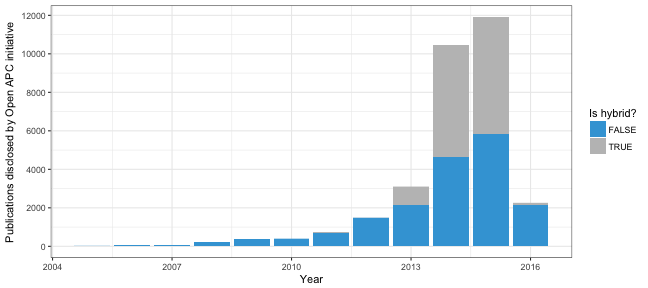
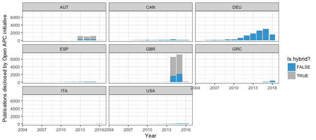

## Summarizing Open APC data
<https://github.com/openapc/openapc-de>
Required libraries


```r
library(dplyr)
library(ggplot2)
library(scales)
```

## Load datasets from GitHub 
Get cost data from the Open APC initiatve


```r
apc <- readr::read_csv("https://raw.githubusercontent.com/OpenAPC/openapc-de/master/data/apc_de.csv", col_names = TRUE)
```

```
## Parsed with column specification:
## cols(
##   institution = col_character(),
##   period = col_integer(),
##   euro = col_double(),
##   doi = col_character(),
##   is_hybrid = col_logical(),
##   publisher = col_character(),
##   journal_full_title = col_character(),
##   issn = col_character(),
##   issn_print = col_character(),
##   issn_electronic = col_character(),
##   issn_l = col_character(),
##   license_ref = col_character(),
##   indexed_in_crossref = col_logical(),
##   pmid = col_integer(),
##   pmcid = col_character(),
##   ut = col_character(),
##   url = col_character(),
##   doaj = col_logical()
## )
```

Overview


```r
apc
```

```
## # A tibble: 31,011 × 18
##    institution period    euro                          doi is_hybrid
##          <chr>  <int>   <dbl>                        <chr>     <lgl>
## 1    Bamberg U   2013 1372.00           10.2147/jpr.s45097     FALSE
## 2    Bamberg U   2013  960.00     10.3389/fpsyg.2013.00318     FALSE
## 3    Bamberg U   2013  960.00     10.3389/fpsyg.2013.00406     FALSE
## 4    Bamberg U   2013  960.00     10.3389/fpsyg.2013.00453     FALSE
## 5    Bamberg U   2013  182.00 10.6000/1929-4409.2013.02.32     FALSE
## 6    Bamberg U   2013  405.79                10.1068/i0605     FALSE
## 7    Bamberg U   2013 1019.30 10.1371/journal.pone.0079164     FALSE
## 8    Bamberg U   2013 1022.78 10.1371/journal.pone.0083277     FALSE
## 9    Bamberg U   2013  229.61        10.5430/ijhe.v2n4p214     FALSE
## 10   Bamberg U   2013 2010.00     10.1186/1471-2202-14-154     FALSE
## # ... with 31,001 more rows, and 13 more variables: publisher <chr>,
## #   journal_full_title <chr>, issn <chr>, issn_print <chr>,
## #   issn_electronic <chr>, issn_l <chr>, license_ref <chr>,
## #   indexed_in_crossref <lgl>, pmid <int>, pmcid <chr>, ut <chr>,
## #   url <chr>, doaj <lgl>
```

get insitution coding the OLAP server uses


```r
inst <- readr::read_csv("https://raw.githubusercontent.com/OpenAPC/openapc-olap/master/static/institutions.csv", 
                        col_names = TRUE)
```

```
## Parsed with column specification:
## cols(
##   institution = col_character(),
##   institution_cubes_name = col_character(),
##   institution_full_name = col_character(),
##   continent = col_character(),
##   country = col_character(),
##   state = col_character()
## )
```

Overview


```r
inst
```

```
## # A tibble: 93 × 6
##         institution institution_cubes_name
##               <chr>                  <chr>
## 1         Bamberg U              bamberg_u
## 2       Bielefeld U            bielefeld_u
## 3  Duisburg-Essen U       duisburg_essen_u
## 4         FU Berlin              fu_berlin
## 5       GFZ-Potsdam            gfz_potsdam
## 6        Konstanz U             konstanz_u
## 7         Leipzig U               lepzig_u
## 8               MPG                    mpg
## 9      Regensburg U           regensburg_u
## 10     TU Clausthal           tu_clausthal
## # ... with 83 more rows, and 4 more variables:
## #   institution_full_name <chr>, continent <chr>, country <chr>,
## #   state <chr>
```

merge datasets


```r
apc <- apc %>%
  left_join(inst, by = "institution")
```

## Plots
Plot a timeline without articles paid in 2017 grouped by hybrid / fully OA journals. 
Prepare the dataset first:


```r
apc_time <- apc %>%
  group_by(period, is_hybrid, country) %>%
  summarize(articles = n()) %>%
  filter(period != 2017)
apc_time
```

```
## Source: local data frame [67 x 4]
## Groups: period, is_hybrid [19]
## 
##    period is_hybrid country articles
##     <int>     <lgl>   <chr>    <int>
## 1    2005     FALSE     DEU        5
## 2    2006     FALSE     DEU       52
## 3    2007     FALSE     DEU       88
## 4    2008     FALSE     CAN       23
## 5    2008     FALSE     DEU      182
## 6    2009     FALSE     CAN       38
## 7    2009     FALSE     DEU      318
## 8    2010     FALSE     CAN       83
## 9    2010     FALSE     DEU      307
## 10   2010     FALSE     ESP        8
## # ... with 57 more rows
```

Create the plot:


```r
plot_time <- ggplot(apc_time, aes(period, articles, group = is_hybrid, fill = is_hybrid)) +
  geom_bar(stat="identity") +
  geom_col(position = position_stack(reverse = TRUE)) +
  xlab("Year") +
  ylab("Publications disclosed by Open APC initiative") +
  scale_y_continuous(breaks= pretty_breaks()) +
  scale_fill_manual("Is hybrid?", values = c("#3EA4D9", "grey75")) +
  theme_bw()
```

```r
plot_time
```



```r
ggsave("plot_time.pdf", plot_time, dpi = 300, height=4, width=9)
```

Facet the plot by country


```r
plot_time + facet_wrap(~country, ncol = 3)
```



```r
ggsave("plot_time_country.pdf", dpi = 300, height=4, width=9)
```

