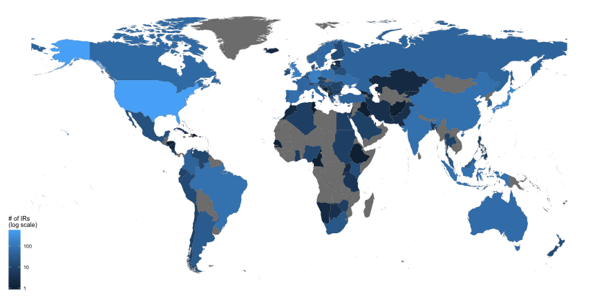

## Plotting Global Distribution of Institutional Repositories
Source ROAR: <http://roar.eprints.org/rawlist.xml> tranformed to JSON
with Catmandu

Prepared during OSI 2017 meeting with input of the IR working group

Required libraries


```r
library(ggplot2)  # FYI you need v2.0
library(dplyr)
library(ggalt)    # devtools::install_github("hrbrmstr/ggalt")
library(ggthemes) # theme_map and tableau colors
library(maptools) # world map

# create data frame of variables needed
doc <- jsonlite::fromJSON(file("data/roar.json"))
types <- (doc$eprint[[1]]$type)
ids <- (doc$eprint[[1]]$id)
countries <- doc$eprint[[1]]$location$item
names(countries) <- ids
countries_df <- plyr::ldply(countries, dplyr::as_data_frame)

rec_count <- as.numeric(as.character(doc$eprint[[1]]$recordcount))

# filter institutional repos
tmp <- data_frame(ids, types, rec_count) %>%
  filter(types == "institutional") %>%
  left_join(countries_df, by = c("ids" = ".id")) %>%
  dplyr::as_data_frame()
# there were some duplicates, filter them out
inst_df <- tmp %>% distinct(ids, .keep_all = TRUE)

# Frequency table
inst_count <-
  inst_df %>%
  filter(!is.na(country)) %>%
  group_by(country) %>%
  count(sort = TRUE) %>%
  mutate(prop = n / sum(n)) %>%
  mutate(country = toupper(country))
```

Plot world map


```r
data(wrld_simpl)
my_map <- fortify(wrld_simpl, region = "ISO2") %>%
  filter(!id == "AQ")

map_df <-
  left_join(my_map, inst_count, by = c("id" = "country")) %>%
  mutate(n = ifelse(is.na(n), 0, n))
gg <- ggplot() +
  geom_map(
    data = map_df,
    map = map_df,
    aes(
      x = long,
      y = lat,
      map_id = id,
      fill = n
    ),
    color = "#191919",
    size = 0.05
  ) +
  theme_map() +
  scale_fill_gradient(name = "# of IRs\n(log scale)", trans = "log10")
```

export


```r
gg
```



